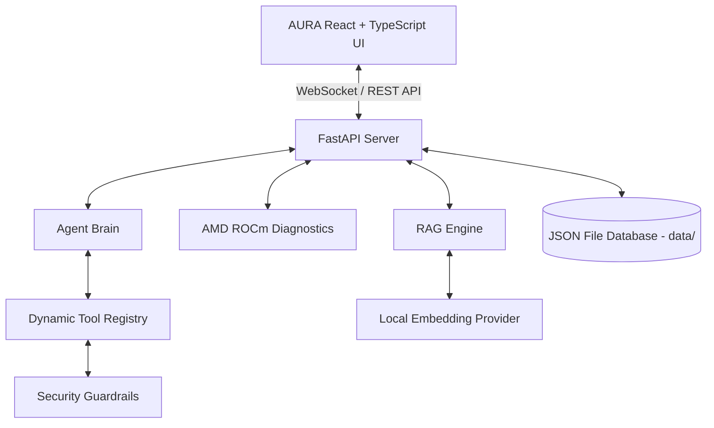

# AURA — Architecture Specification

## System Components

1. **Frontend (`src/`)**:
   - Built with React 18, TypeScript, Vite, and Tailwind CSS v4.
   - Real-time status orb visualization (`Orb.tsx`), live activity feed (`ActivityFeed.tsx`), permission bar (`PermissionBar.tsx`), and multi-tab observability panels (`Panels.tsx`).

2. **Backend Server (`backend/main.py`)**:
   - FastAPI app exposing REST endpoints (`/health`, `/api/system`, `/api/models`, `/api/chat`, `/api/documents`, `/api/memory`, `/api/tools`, `/api/metrics`, `/api/amd`, `/api/benchmark`) and WebSocket endpoint (`/ws/voice`).

3. **JSON Database Persistence (`backend/db/json_db.py`)**:
   - Atomic file repository managing `conversations.json`, `memories.json`, `documents.json`, `tasks.json`, `projects.json`, `settings.json`, `metrics.json`, and `users.json` in the `data/` directory.

4. **Agent Brain (`backend/agent/brain.py`)**:
   - Autonomous execution loop: Intent Recognition -> Tool Selection -> Permission Verification -> Tool Execution -> Verification -> Response Synthesis.

5. **AMD ROCm Integration (`backend/amd/diagnostics.py`)**:
   - Hardware discovery module querying `rocm-smi` and PyTorch HIP. Reports real hardware metrics without fabrication.

6. **Security Engine (`backend/security/guard.py`)**:
   - Handles prompt injection sanitization, path traversal protection, file validation, secret redaction, and permission enforcement (READ, WRITE, DESTRUCTIVE).
